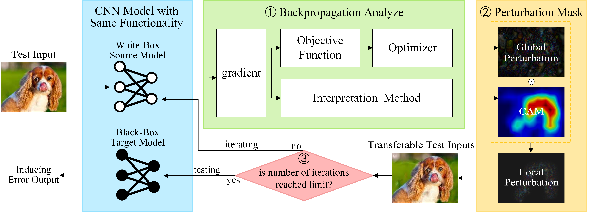








I am a Ph.D. student at Southeast University, supervised by Professor [Bixin Li](https://scholar.google.com/citations?hl=zh-CN&user=nxQBSlgAAAAJ), and a visiting Ph.D. student at Monash University, advised by Professor [Yongqiang Tian](https://yqtian.com/index.html). I received my Master's degree from Beijing Information Science and Technology University, under the supervision of Professor [Zhanqi Cui](https://zqcui.github.io/).

My research interests include SE4AI, trustworthy AI, and LLM safety. If you are interested in my research, please feel free to contact me. 🙌

# 🔥 News
- *2026.05*: &nbsp;🎉 I was awarded funding from the CSC to support my visiting Ph.D. study at Monash University.
- *2024.11*: &nbsp;🎉🎉 One paper is accepted by TOSEM. 

# 📝 Publications 

TOSEM (CCF-A)

[IATT: Interpretation Analysis-based Transferable Test Generation for Convolutional Neural Networks](https://dl.acm.org/doi/10.1145/3705301)

**Ruilin Xie**, Xiang Chen, Qifan He, Bixin Li, Zhanqi Cui
- Proposes a new test scenario for black-box CNN models. In this scenario, the testing method
 generates transferable test inputs for the BTM by analyzing a WSM with similar functionalities
 to the target black-box model.
- Proposes an IATT method for the new testing scenario. By iteratively optimizing the trans
ferability and realism of the test inputs, the test inputs generated by IATT can be effectively
 test models with different model structures, training sets, or task domains.

🖥️[**Code**](https://github.com/samxrl/IATT)

- 软件学报 &nbsp; **IADT: 基于解释分析的深度神经网络差分测试**

     <strong><em>谢瑞麟</em></strong>, 崔展齐, 陈翔, 李莉.
    软件学报, 2024. (中文CCF-A)

    📃[**Paper**](https://www.jos.org.cn/jos/article/abstract/7088)

- 软件学报 &nbsp; **IATG: 基于解释分析的自动驾驶软件测试方法**

     <strong><em>谢瑞麟</em></strong>, 崔展齐, 陈翔, 郑丽伟.
    软件学报, 2024. (中文CCF-A)

    📃[**Paper**](https://www.jos.org.cn/jos/article/abstract/6836)

- 软件学报 &nbsp; **DeepRanger:覆盖制导的深度森林测试方法**

     崔展齐, <strong><em>谢瑞麟</em></strong>, 陈翔, 刘秀磊, 郑丽伟.
    软件学报, 2023. (中文CCF-A, 导师一作)

    📃[**Paper**](https://www.jos.org.cn/jos/article/abstract/6422)

- 计算机研究与发展 &nbsp; **基于可解释性分析的深度神经网络优化方法**

     吴欢欢, <strong><em>谢瑞麟</em></strong>, 乔塬心, 陈翔, 崔展齐.
    计算机研究与发展, 2024. (中文CCF-A)

    📃[**Paper**](https://crad.ict.ac.cn/article/doi/10.7544/issn1000-1239.202220803)

- DSA &nbsp; **Testing Coverage Criteria for Deep Forests**

     <strong><em>Ruilin Xie</em></strong>, Zhanqi Cui, Minghua Jia, Yuan Wen and Baoshui Hao.
    2019 6th International Conference on Dependable Systems and Their Applications (DSA), 2020. (EI)

    📃[**Paper**](https://ieeexplore.ieee.org/document/9045858)

- SMC &nbsp; **Perturbing and Backtracking based Textual Adversarial Attack**

     Yuanxin Qiao, <strong><em>Ruilin Xie</em></strong>, Songcheng Xie and Zhanqi Cui.
    2024 IEEE International Conference on Systems, Man, and Cybernetics (SMC), 2024. (CCF-C)

    📃[**Paper**](https://ieeexplore.ieee.org/document/10366669)

- QRS &nbsp; **DeepIA: An Interpretability Analysis based Test Data Generation Method for DNN**

     Qifan He, <strong><em>Ruilin Xie</em></strong>, Li Li, Zhanqi Cui.
    the IEEE 23rd IEEE International Conference on Software Quality, Reliability, and Security (QRS), 2023. (CCF-C)

    📃[**Paper**](https://ieeexplore.ieee.org/document/10366669)

- SMC &nbsp; **MOBTAG: Multi-objective Optimization based Textual Adversarial Example Generation**

     Yuanxin Qiao, <strong><em>Ruilin Xie</em></strong>, Li Li, Qifan He, Zhanqi Cui.
    the IEEE International Conference on Systems, Man, and Cybernetics (SMC), 2023. (CCF-C)

    📃[**Paper**](https://ieeexplore.ieee.org/document/10394175)

- SANER Workshop &nbsp; **SICUP: A Comment Updating Approach based on Structural Information**

     Shifan Liu, Zhanqi Cui*, <strong><em>Ruilin Xie</em></strong>.
    1st International Workshop on Software Engineering & Deep Learning(SE&DL), co-located with SANER 2023. (EI)

    📃[**Paper**](https://ieeexplore.ieee.org/document/10123654)

# 🎖 Honors and Awards
- *2024* Beijing’s Outstanding Master’s Degree Graduates
- *2024* Outstanding Graduation Thesis. 
- *2023* Graduate National Scholarship. 
- *2023* Graduate Academic Scholarship Third Prize.
- *2023* High‑Level Academic Paper Award Second Prize.
- *2022* Graduate Academic Scholarship First Prize.
- *2022* Graduate Outstanding Research Achievement Award.

# 📖 Educations
- *2024.09 - (now)*, PhD in Software Engineering, Southeast University. 
- *2021.09 - 2024.06*, Master in Computer Technology, Beijing Information Science and Technology University. 
- *2015.09 - 2019.06*, Undergraduate in Software Engineering. Beijing Information Science and Technology University. 

[//]: # (# 💬 Invited Talks)

[//]: # (- *2021.06*, Lorem ipsum dolor sit amet, consectetur adipiscing elit. Vivamus ornare aliquet ipsum, ac tempus justo dapibus sit amet. )

[//]: # (- *2021.03*, Lorem ipsum dolor sit amet, consectetur adipiscing elit. Vivamus ornare aliquet ipsum, ac tempus justo dapibus sit amet.  \| [\[video\]]&#40;https://github.com/&#41;)

[//]: # (# 💻 Internships)

[//]: # (- *2019.05 - 2025.02*, [Lorem]&#40;https://github.com/&#41;, China.)
