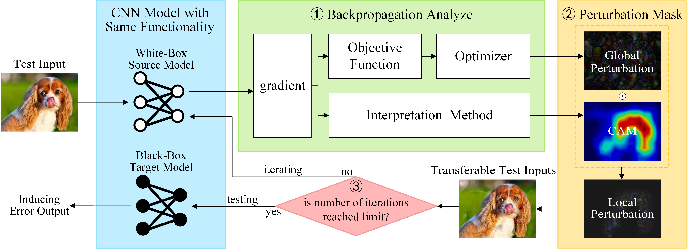








I am a Ph.D. student at Southeast University, supervised by Professor [Bixin Li](https://scholar.google.com/citations?hl=zh-CN&user=nxQBSlgAAAAJ). I received my Master's degree from Beijing Information Science and Technology University, under the supervision of Professor [Zhanqi Cui](https://zqcui.github.io/).

My research interests include SE4AI, trustworthy AI, and LLM safety. If you are interested in my research, please feel free to contact me. 🙌

# 🔥 News
- *2024.11*: &nbsp;🎉🎉 One paper is accepted by TOSEM. 

# 📝 Publications 

TOSEM

[IATT: Interpretation Analysis-based Transferable Test Generation for Convolutional Neural Networks](https://dl.acm.org/doi/10.1145/3705301)

**Ruilin Xie**, Xiang Chen, Qifan He, Bixin Li, Zhanqi Cui
- Proposes a new test scenario for black-box CNN models. In this scenario, the testing method
 generates transferable test inputs for the BTM by analyzing a WSM with similar functionalities
 to the target black-box model.
- Proposes an IATT method for the new testing scenario. By iteratively optimizing the trans
ferability and realism of the test inputs, the test inputs generated by IATT can be effectively
 test models with different model structures, training sets, or task domains.

🖥️[**Code**](https://github.com/samxrl/IATT)

[//]: # (- JOS &#40;软件学报&#41; &nbsp; [IATD:Interpretability Analysis based Differential Testing for)

[//]: # ( DeepNeuralNetworks]&#40;https://www.jos.org.cn/jos/article/abstract/7088&#41;, **Ruilin Xie**, Zhanqi Cui, Xiang Chen, Li Li . `in Chinese`)

[//]: # (- JOS &#40;软件学报&#41; &nbsp; [IATG: Interpretation-analysis-based Testing Method for Autonomous Driving Software]&#40;https://www.jos.org.cn/jos/article/abstract/6836&#41;, **Ruilin Xie**, Zhanqi Cui*, Xiang Chen, LiweiZheng . `in Chinese`)

[//]: # (- JOS &#40;软件学报&#41; &nbsp; [DeepRanger: Coverage-guided Deep Forest Testing Approach]&#40;https://www.jos.org.cn/jos/article/abstract/6422&#41;, ZhanqiCui, **RuilinXie**, XiangChen, XiuleiLiu, LiweiZheng . `Supervisor 1st Author, in Chinese`)

- 软件学报 &nbsp; **IADT: 基于解释分析的深度神经网络差分测试**

     <strong><em>谢瑞麟</em></strong>, 崔展齐, 陈翔, 李莉.
    软件学报, 2024. (中文CCF-A)

📃[**Paper**](https://www.jos.org.cn/jos/article/abstract/7088)

- 软件学报 &nbsp; **IATG: 基于解释分析的自动驾驶软件测试方法**

     <strong><em>谢瑞麟</em></strong>, 崔展齐, 陈翔, 郑丽伟.
    软件学报, 2024. (中文CCF-A)

📃[**Paper**](https://www.jos.org.cn/jos/article/abstract/6836)

- 软件学报 &nbsp; **DeepRanger:覆盖制导的深度森林测试方法**

     崔展齐, <strong><em>谢瑞麟</em></strong>, 陈翔, 刘秀磊, 郑丽伟.
    软件学报, 2023. (中文CCF-A, 导师一作)

📃[**Paper**](https://www.jos.org.cn/jos/article/abstract/6422)

# 🎖 Honors and Awards
- *2024* Beijing’s Outstanding Master’s Degree Graduates
- *2024* Outstanding Graduation Thesis. 
- *2023* Graduate National Scholarship. 
- *2023* Graduate Academic Scholarship Third Prize.
- *2023* High‑Level Academic Paper Award Second Prize.
- *2022* GraduateAcademicScholarship First Prize.
- *2022* Graduate Outstanding Research Achievement Award.

# 📖 Educations
- *2024.06 - (now)*, PhD in Software Engineering, Southeast University. 
- *2021.09 - 2024.06*, Master in Computer Technology, Beijing Information Science and Technology University. 
- *2015.06 - 2019.09*, Undergraduate in Software Engineering. Beijing Information Science and Technology University. 

[//]: # (# 💬 Invited Talks)

[//]: # (- *2021.06*, Lorem ipsum dolor sit amet, consectetur adipiscing elit. Vivamus ornare aliquet ipsum, ac tempus justo dapibus sit amet. )

[//]: # (- *2021.03*, Lorem ipsum dolor sit amet, consectetur adipiscing elit. Vivamus ornare aliquet ipsum, ac tempus justo dapibus sit amet.  \| [\[video\]]&#40;https://github.com/&#41;)

[//]: # (# 💻 Internships)

[//]: # (- *2019.05 - 2025.02*, [Lorem]&#40;https://github.com/&#41;, China.)